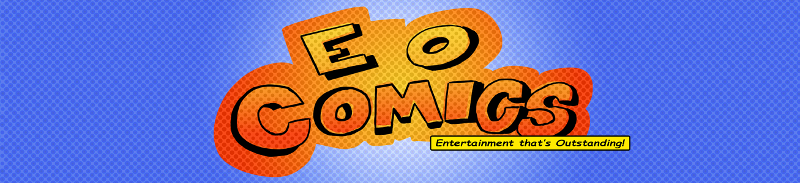
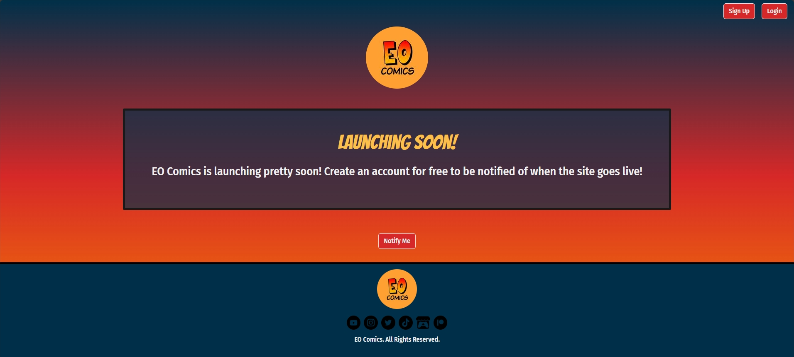

<!-- # 🔥EFlame01's Domain🔥 -->
<h1 align="center">
  🔥EFlame01's Domain🔥
</h1>

<h2>
  About Me
</h2>
This is S.A. the founder of EO Comics! My goal is to make entertainment based on the stories and experiences that I want to tell. This GitHub page details all the projects that I want/am implementing in the tech space, and I hope to share them with you in the near future!

## My Projects
### EO Comics Website

### Guardians of RPG
#### The Video Game
#### The Comcis
### Zach Against the World
#### The Animated Series
#### Video Games
##### Zach Against the World and the Attack of the Killer Plants
#### Comics
##### Zach Against the World: The Series
##### Zach Against the World: In a League of His Own

## Collaborative Projects
### Train of Thought

## What I'm Learning
* Docker/Kubernetes
* AWS
* DevOps
* Game Development

## Skill Tree
* Java
* C#
* Javascript
* HTML/CSS
* Python
* SQL
* C/C++

## Software I Used
* WonderShare Filmora
* Clip Studio Paint
* Unity
* Visual Studio Code
* Eclipse
* IntelliJ
* Arduino IDE

### Where to Find Me:

  
  
  
  
  

<!--
**EFlame01/EFlame01** is a ✨ _special_ ✨ repository because its `README.md` (this file) appears on your GitHub profile.

Here are some ideas to get you started:

- 🔭 I’m currently working on ...
- 🌱 I’m currently learning ...
- 👯 I’m looking to collaborate on ...
- 🤔 I’m looking for help with ...
- 💬 Ask me about ...
- 📫 How to reach me: ...
- 😄 Pronouns: ...
- ⚡ Fun fact: ...
-->
