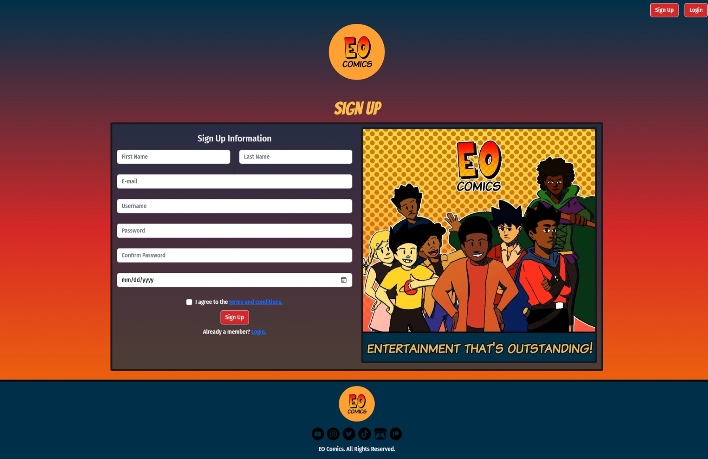

<!-- # 🔥EFlame01's Domain🔥 -->
<h1 align="center">👷🏿‍♂️README UNDER CONSTRUCTION 🏗️</h1>

  <h2>About Me</h2>  
  
  
  
  

  <b>
  
  This is S.A. the founder of EO Comics! My goal is to make entertainment based on the stories and experiences that I want to tell. This GitHub page details all the projects that I want/am implementing in the tech space, and I hope to share them with you in the near future!
  

  <h2>My GitHub Projects</h2>

  

    <h2 align="center">💻 EO Comics Website</h2>
     
    

    <table>
      <thead align="center">
        <tr>
          <td>
            
          </td>
          <td>
            
          </td>
        </tr>
      </thead>
    </table>
    

     
    

      

        I'm currently in the process of developing my own website for EO Comics! This website will contain all the updated projects that EO Comics has to offer, such as comics, video games, and animated content! In addition to this, it will also have blogs and frequent update posts to keep my audience up to date with any future EO Comics endeavors!
      

    

   
  

    <h2 align="center">🎮 Guardians of RPG</h2>
     
    

      <table>
        <thead align="center">
          <tr>
            <td>
              
            </td>
            <td>
              
            </td>
          </tr>
        </thead>
      </table>
    

    

       
      <!-- 

        
      
 -->
      

        Guardians of RPG is a 16 bit Role Playing where you wake up in the middle of the world with no memories of your past life. In your quest to find the answers to your past and your purpose, you learn more about the world and the evil organization that's hell bent on refactoring the land of RPG into their own image!
      

      

        Explore the framework that contributes to the creation of this sprawling epic for free on my GitHub!
      

      

        

          
          
        

         
        

          
          
        

         
        

          
          
        

         
        

          
          
        

         
        
      

    

  

 

## What I'm Learning
* Docker/Kubernetes
* AWS
* DevOps
* Game Development
* Moho

## Skill Tree
* Java
* C#
* Javascript
* HTML/CSS
* Python
* SQL
* C/C++

## Software I Used
* WonderShare Filmora
* Clip Studio Paint
* Unity
* Visual Studio Code
* Eclipse
* IntelliJ
* Arduino IDE

## 📊 Check out my stats

    
    

 

    

<h3>Where to Find Me:</h3>

  
  
  
  
  

<!--
**EFlame01/EFlame01** is a ✨ _special_ ✨ repository because its `README.md` (this file) appears on your GitHub profile.

Here are some ideas to get you started:

- 🔭 I’m currently working on ...
- 🌱 I’m currently learning ...
- 👯 I’m looking to collaborate on ...
- 🤔 I’m looking for help with ...
- 💬 Ask me about ...
- 📫 How to reach me: ...
- 😄 Pronouns: ...
- ⚡ Fun fact: ...
-->
